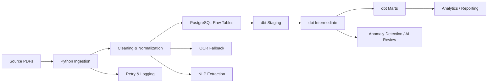

# Pipeline Architecture

```mermaid
flowchart LR
    A[Source PDFs] --> B[Python Ingestion]
    B --> C[Cleaning & Normalization]
    C --> D[PostgreSQL Raw Tables]
    D --> E[dbt Staging]
    E --> F[dbt Intermediate]
    F --> G[dbt Marts]
    G --> H[Analytics / Reporting]

    B --> I[Retry & Logging]
    C --> J[OCR Fallback]
    C --> K[NLP Extraction]
    F --> L[Anomaly Detection / AI Review]
```